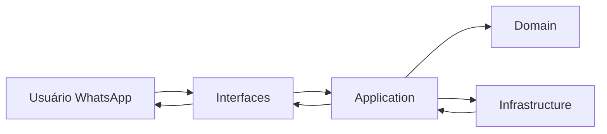
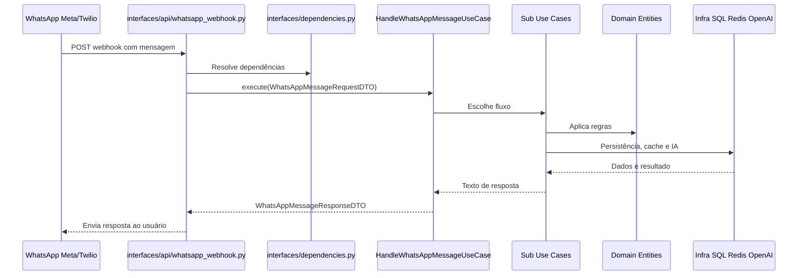
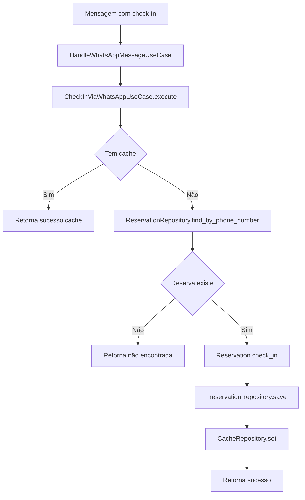
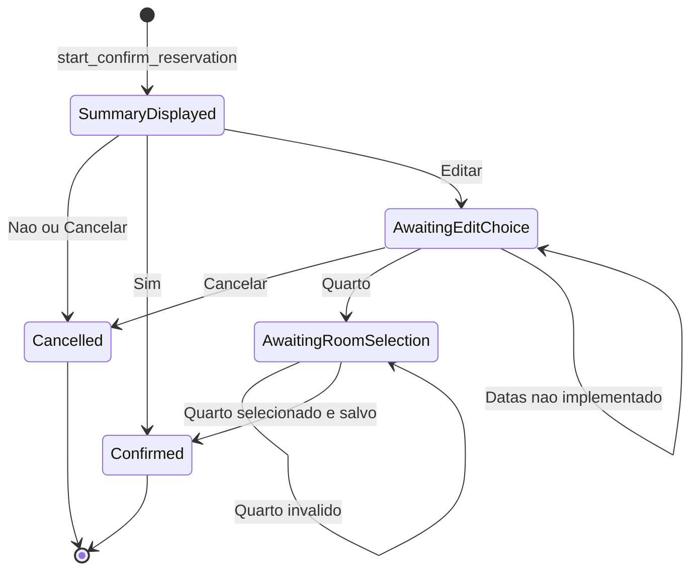
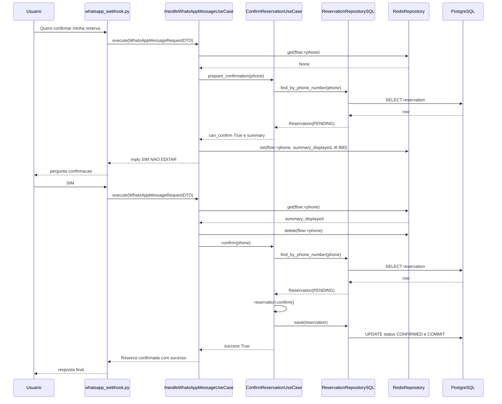
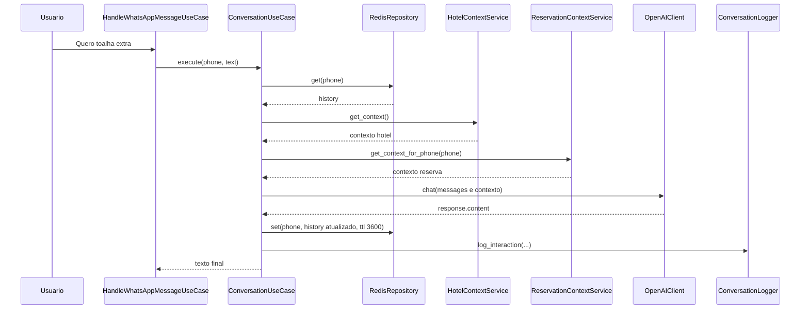

# Guia Didático Completo da Arquitetura (Camada por Camada)

Objetivo deste guia: explicar o projeto para quem está começando, com linguagem simples, fluxos visuais e mapeamento classe por classe e método por método.

---

## 0) Explicação simples (analogia)

Pense no sistema como um hotel com setores:

- **Portaria** = camada `interfaces`
	- recebe mensagem do WhatsApp (Meta/Twilio)
	- entrega para o setor interno certo
- **Gerência operacional** = camada `application`
	- decide o que fazer: check-in, confirmar reserva, conversar com IA
- **Regras do hotel** = camada `domain`
	- define o que pode e o que não pode (ex.: check-in inválido)
- **Ferramentas externas** = camada `infrastructure`
	- banco SQL, Redis, OpenAI, APIs WhatsApp

Regra de ouro da arquitetura limpa:

- As regras de negócio não devem depender de framework, banco, API externa.
- O centro (domínio) é o mais estável; fora dele ficam detalhes técnicos.

---

## 1) Mapa rápido de camadas



Arquivo fonte: `docs/diagrams/01-layer-map.mmd`

**Leitura correta:**
- `interfaces` conversa com o mundo externo.
- `application` orquestra casos de uso.
- `domain` contém regras centrais.
- `infrastructure` implementa portas/contratos.

---

## 2) Fluxo ponta a ponta (do webhook até a resposta)



Arquivo fonte: `docs/diagrams/02-e2e-webhook-sequence.mmd`

---

## 3) Camada de Interface (classe por classe)

### 3.1 `app/main.py`

- Cria a aplicação FastAPI.
- Registra o router de webhook.

### 3.2 `app/interfaces/api/whatsapp_webhook.py`

#### Responsabilidade
- Receber payload HTTP.
- Transformar para DTO de entrada.
- Chamar use case principal.
- Enviar resposta pelo provedor.

#### Métodos importantes

- `verify_webhook(request)`
	- valida token de assinatura da Meta.

- `receive_whatsapp_message(request, use_case)`
	- endpoint Meta (`POST /webhook/whatsapp`).
	- valida payload e itera mensagens.

- `receive_twilio_whatsapp_message(request, use_case)`
	- endpoint Twilio (`POST /webhook/whatsapp/twilio`).
	- lê `form-data` e chama use case.

- `_handle_incoming_message(message, use_case)`
	- marca mensagem como lida (Meta).
	- extrai conteúdo (`text`, `button`, `interactive` etc).
	- cria `WhatsAppMessageRequestDTO`.
	- chama `HandleWhatsAppMessageUseCase.execute`.
	- envia resposta ao usuário.

- `_extract_message_content(message, msg_type)`
	- normaliza payloads diferentes para uma string única.

- `_handle_message_status(status)`
	- trata status de entrega (observabilidade).

### 3.3 `app/interfaces/dependencies.py` (Composition Root)

Esse arquivo é essencial para entender arquitetura limpa.

- Ele **monta objetos concretos** e injeta nos use cases.
- É o único lugar onde detalhes de infra aparecem juntos.

Métodos:

- `get_checkin_use_case()`
- `get_reservation_context_service()`
- `get_hotel_context_service()`
- `get_conversation_use_case()`
- `get_conversation_use_case_memory()` (modo teste)
- `get_whatsapp_message_use_case()`

Design Pattern aplicado: **Dependency Injection + Composition Root**.

---

## 4) Camada de Application (classe por classe, método por método)

Esta camada contém os **casos de uso** (regras de processo) e DTOs.

## 4.1 O que é DTO (explicação simples)

DTO = **Data Transfer Object**.

É uma “caixinha de dados” para transportar informação entre camadas.

- Não faz regra de negócio.
- Não fala com banco.
- Não decide fluxo.
- Só carrega dados.

DTOs do projeto:

- `WhatsAppMessageRequestDTO(phone, message, source)`
- `WhatsAppMessageResponseDTO(reply, success, error)`
- `CheckinRequestDTO(phone, name, room)`
- `CheckinResponseDTO(message, success, error)`
- `ConfirmReservationRequestDTO(phone)`
- `ConfirmReservationResponseDTO(message, success, can_confirm, summary, status)`

### 4.2 `HandleWhatsAppMessageUseCase`

Arquivo: `app/application/use_cases/handle_whatsapp_message.py`

#### Papel
- É o “roteador interno” do negócio.
- Recebe toda mensagem e decide o subfluxo.

#### Método principal

- `execute(request_dto)`
	1. Normaliza texto.
	2. Verifica se existe fluxo em andamento (`flow:{phone}` no cache).
	3. Detecta intenção de confirmar reserva.
	4. Detecta intenção de check-in.
	5. Se não cair em nada específico, vai para conversa com IA.

#### Métodos internos de confirmação

- `_start_confirm_reservation_flow(phone)`
	- chama `prepare_confirmation`.
	- salva estado inicial no cache (TTL 900s).
	- monta pergunta `SIM / NÃO / EDITAR`.

- `_handle_confirm_reservation_flow(phone, content_lower, flow_state)`
	- despacha para etapa correta.

- `_handle_summary_response(...)`
	- `SIM` -> confirma reserva.
	- `NÃO` -> cancela fluxo.
	- `EDITAR` -> vai para escolha de edição.

- `_handle_edit_choice(...)`
	- `QUARTO` -> busca quartos disponíveis.
	- `DATAS` -> ainda não implementado.

- `_handle_room_selection(...)`
	- aplica quarto escolhido e salva reserva.

#### Helpers

- `_is_confirm_reservation_intent`
- `_is_positive_confirmation`
- `_is_negative_confirmation`
- `_is_edit_request`
- `_get_flow_state`
- `_set_flow_state`
- `_clear_flow_state`

### 4.3 `CheckInViaWhatsAppUseCase`

Arquivo: `app/application/use_cases/checkin_via_whatsapp.py`

Método:

- `execute(request_dto)`
	1. Tenta cache.
	2. Busca reserva por telefone.
	3. Executa `reservation.check_in()` (domínio).
	4. Persiste no repositório.
	5. Atualiza cache.
	6. Retorna DTO de resposta.

### 4.4 `ConfirmReservationUseCase`

Arquivo: `app/application/use_cases/confirm_reservation.py`

Métodos:

- `prepare_confirmation(request_dto)`
	- valida existência.
	- bloqueia estados inválidos.
	- retorna resumo e flag `can_confirm`.

- `confirm(request_dto)`
	- valida estados.
	- chama `reservation.confirm()`.
	- salva no repositório.

- `get_formatted_summary(reservation)`
	- formata resumo rico (emoji/texto).

- `_build_summary(reservation)`
	- versão simples de resumo.

### 4.5 `ConversationUseCase`

Arquivo: `app/application/use_cases/conversation.py`

Método principal:

- `execute(phone, text)`
	1. Recupera histórico no cache.
	2. Converte histórico para `Message`.
	3. Adiciona mensagem do usuário.
	4. Chama IA com contexto de hotel + reserva.
	5. Adiciona resposta no histórico.
	6. Persiste histórico no cache.
	7. Loga interação.
	8. (Opcional) envia via provider.

Métodos internos:

- `_get_conversation_history(phone)`
- `_call_ai(messages, phone)`
- `_update_conversation_history(phone, messages)`
- `_send_message(phone, message)`
- `_log_interaction(phone, user_message, ai_response)`

### 4.6 Serviços de contexto

- `HotelContextService`
	- `get_context()` monta texto do hotel.
	- `_load_context_data()` lê do `HotelRepository`.
	- `_append_if(...)` helper de montagem.

- `ReservationContextService`
	- `get_context_for_phone(phone)` monta texto da reserva ativa.
	- `_format_status(status)` traduz enum para texto amigável.

### 4.7 Portas de aplicação

- `AIService` (interface): `chat`, `complete`.
- `InteractionLogger` (interface): `log_interaction`.

---

## 5) Camada de Domínio (o “coração”)

### 5.1 Entidades e Value Objects

- `Reservation` (entidade principal)
	- `check_in(room_number=None)`
	- `check_out()`
	- `cancel()`
	- `confirm()`
	- `mark_as_no_show()`
	- `is_active()`
	- `can_checkin()`
	- `to_dict()`

- `StayPeriod` (value object de período)
	- valida datas no construtor
	- `is_checkin_allowed(today)`
	- `is_checkout_allowed(today)`
	- `is_active(today)`
	- `number_of_nights()`
	- `overlaps_with(other)`

- `Message` (value object de conversa)
	- valida role e conteúdo
	- `to_dict()`

- `PhoneNumber` (value object)
	- valida formato mínimo

- `Room` (entidade/objeto de domínio de quarto)
	- campos: número, tipo, diária, capacidade, status

### 5.2 Repositórios (contratos)

- `ReservationRepository`
	- `save(reservation)`
	- `find_by_phone_number(phone_number)`

- `RoomRepository`
	- `get_by_number(room_number)`
	- `find_available(check_in, check_out, exclude_room=None)`
	- `is_available(room_number, check_in, check_out)`

- `HotelRepository`
	- `get_active_hotel()`
	- `save(hotel)`

- `CacheRepository`
	- `get`, `set`, `delete`, `exists`, `clear`

---

## 6) Camada de Infrastructure (adapters concretos)

### 6.1 Persistência SQL

- `ReservationRepositorySQL`
	- `find_by_phone_number`:
		- consulta `ReservationModel`
		- mapeia para `Reservation`
	- `save`:
		- update ou insert
		- `session.commit()`

- `RoomRepositorySQL`
	- `get_by_number`
	- `find_available` (com regra de conflito de datas no SQL)
	- `is_available`
	- `_to_domain(room_model)` mapper

- `HotelRepositorySQL`
	- `get_active_hotel`
	- `save`

### 6.2 Cache

- `RedisRepository`
	- `__init__`: abre conexão, faz `ping`.
	- `get`: busca e desserializa JSON.
	- `set`: serializa JSON + TTL.
	- `delete`, `exists`, `clear`.

### 6.3 IA

- `OpenAIClient` (implementa `AIService`)
	- `chat(messages, **kwargs)`
	- `complete(prompt, **kwargs)`

### 6.4 Logging

- `ConversationLogger` (implementa `InteractionLogger`)
	- `log_interaction(...)` grava histórico e custo.
	- `_save()` persiste JSON em `logs/conversation_history.json`.
	- métodos utilitários (`get_stats`, `export_csv`, etc).

### 6.5 Mensageria

- `WhatsAppMetaClient`
	- `send_text_message`, `send_template_message`, `send_button_message` etc.

- `WhatsAppTwilioClient`
	- `send_text_message`, `send_media_message`, `send_template_message`, `get_message_status`.

---

## 7) Fluxos principais (detalhados)

## 7.1 Fluxo de conversa com IA

```mermaid
flowchart TD
  A[Webhook recebe mensagem] --> B[HandleWhatsAppMessageUseCase.execute]
  B --> C[ConversationUseCase.execute]
  C --> D[CacheRepository.get(phone)]
  C --> E[HotelContextService.get_context]
  C --> F[ReservationContextService.get_context_for_phone]
  C --> G[AIService.chat]
  G --> H[OpenAIClient.chat para OpenAI API]
  C --> I[CacheRepository.set(phone, history)]
  C --> J[InteractionLogger.log_interaction]
  C --> K[Retorna resposta]
  K --> L[Webhook envia mensagem ao usuário]
```

Arquivo fonte: `docs/diagrams/03-ai-conversation-flow.mmd`

## 7.2 Fluxo de check-in



Arquivo fonte: `docs/diagrams/04-checkin-flow.mmd`

## 7.3 Fluxo de confirmação de reserva



Arquivo fonte: `docs/diagrams/05-reservation-confirmation-state.mmd`

---

## 8) Design Patterns usados no projeto

### 8.1 DTO (Data Transfer Object)

Para que serve:
- transportar dados entre camadas sem levar regra de negócio junto.

Onde está:
- `app/application/dto/*`

Por que isso ajuda:
- evita acoplamento direto entre HTTP e domínio.
- facilita testes e evolução de APIs.

### 8.2 Repository Pattern

Contrato no domínio:
- `ReservationRepository`, `RoomRepository`, `HotelRepository`, `CacheRepository`.

Implementação na infraestrutura:
- `ReservationRepositorySQL`, `RoomRepositorySQL`, `HotelRepositorySQL`, `RedisRepository`.

Benefício:
- a regra de negócio não sabe se o dado vem de SQL, Redis, memória etc.

### 8.3 Dependency Injection

Onde:
- `app/interfaces/dependencies.py`.

Benefício:
- troca de implementação sem mudar o caso de uso.

### 8.4 Adapter Pattern

Exemplos:
- `OpenAIClient` adapta SDK OpenAI para interface `AIService`.
- `WhatsAppMetaClient`/`WhatsAppTwilioClient` adaptam APIs externas.

### 8.5 Use Case / Application Service

Exemplos:
- `HandleWhatsAppMessageUseCase`
- `CheckInViaWhatsAppUseCase`
- `ConfirmReservationUseCase`
- `ConversationUseCase`

Benefício:
- organiza processos de negócio em passos claros e testáveis.

---

## 9) Como ler o código sem se perder (roteiro de estudo)

Ordem recomendada:

1. `app/main.py`
2. `app/interfaces/api/whatsapp_webhook.py`
3. `app/interfaces/dependencies.py`
4. `app/application/use_cases/handle_whatsapp_message.py`
5. `app/application/use_cases/conversation.py`
6. `app/application/use_cases/checkin_via_whatsapp.py`
7. `app/application/use_cases/confirm_reservation.py`
8. `app/domain/entities/reservation/reservation.py`
9. `app/infrastructure/persistence/sql/reservation_repository_sql.py`
10. `app/infrastructure/cache/redis_repository.py`
11. `app/infrastructure/ai/openai_client.py`

---

## 10) Onde estão os pontos críticos para evoluir

1. Encapsular troca de quarto no domínio (evitar mutação direta no use case).
2. Remover `to_dict()` de entidades para mappers externos.
3. Separar melhor roteamento de intenção por estratégia/comando.
4. Definir transação/sessão por requisição de forma mais controlada.

---

## 11) Resumo final em 5 linhas

1. Webhook recebe mensagem e cria DTO.
2. Use case principal decide o fluxo.
3. Subfluxo aplica regras de domínio.
4. Repositórios/adapters fazem persistência, cache e IA.
5. Interface envia resposta ao usuário.

---

## 12) Tracing real (debug guiado, variável por variável)

Nesta seção vamos simular mensagens reais e seguir cada chamada.

Importante:
- os valores abaixo são exemplos didáticos;
- o caminho/métodos está 100% alinhado ao código atual.

### 12.1 Cenário A: usuário manda “quero confirmar minha reserva”

#### Entrada do webhook (Twilio)

`receive_twilio_whatsapp_message()` recebe `form_data` com:

- `From = "whatsapp:+5561998776092"`
- `Body = "quero confirmar minha reserva"`

Transformação na interface:

- `from_phone = " +5561998776092"` (sem prefixo `whatsapp:`)
- `message_body = "quero confirmar minha reserva"`
- DTO criado:
	- `WhatsAppMessageRequestDTO.phone = "+5561998776092"`
	- `WhatsAppMessageRequestDTO.message = "quero confirmar minha reserva"`
	- `WhatsAppMessageRequestDTO.source = "twilio"`

#### Passo no `HandleWhatsAppMessageUseCase.execute()`

Valores locais no início:

- `text = "quero confirmar minha reserva"`
- `content_lower = "quero confirmar minha reserva"`
- `phone = "+5561998776092"`

1) `_get_flow_state(phone)`
- chave consultada: `flow:+5561998776092`
- retorno esperado no primeiro contato: `None`

2) `_is_confirm_reservation_intent(content_lower)`
- `has_confirm = True` (porque tem “confirmar”)
- `has_reservation = True` (porque tem “reserva”)
- resultado: `True`

3) chama `_start_confirm_reservation_flow(phone)`

#### Passo no `ConfirmReservationUseCase.prepare_confirmation()`

1) `reservation_repository.find_by_phone_number(phone)`
- consulta SQL retorna última reserva do telefone.

Exemplo de objeto de domínio retornado:
- `reservation.id = "123"`
- `reservation.status = ReservationStatus.PENDING`
- `reservation.room_number = "101"`
- `reservation.total_amount = 600.0`

2) validações de status:
- não está em `CANCELLED/NO_SHOW/CHECKED_OUT`
- não está `CONFIRMED`
- então `can_confirm = True`

3) retorno DTO:
- `ConfirmReservationResponseDTO.success = True`
- `ConfirmReservationResponseDTO.can_confirm = True`
- `ConfirmReservationResponseDTO.summary = "Resumo..."`

#### Volta para `_start_confirm_reservation_flow`

1) grava estado do fluxo no cache:
- chave: `flow:+5561998776092`
- valor:
	- `{"action": "confirm_reservation", "step": "summary_displayed"}`
- TTL: `900`

2) monta resposta:
- resumo formatado (`get_formatted_summary`)
- texto final com “SIM / NÃO / EDITAR”

3) retorna:
- `WhatsAppMessageResponseDTO.reply = "...SIM / NÃO / EDITAR"`
- `WhatsAppMessageResponseDTO.success = True`

4) webhook envia ao usuário via Twilio/Meta.

### 12.2 Cenário B: usuário responde “SIM”

#### Entrada

- `WhatsAppMessageRequestDTO.message = "SIM"`
- `phone = "+5561998776092"`

#### Passo no `HandleWhatsAppMessageUseCase.execute()`

1) `_get_flow_state(phone)` retorna:
- `{"action": "confirm_reservation", "step": "summary_displayed"}`

2) cai em `_handle_confirm_reservation_flow(...)`

3) como `current_step == "summary_displayed"`, chama `_handle_summary_response(...)`

4) `_is_positive_confirmation("sim")` -> `True`

5) limpa estado:
- `cache_repository.delete("flow:+5561998776092")`

6) chama `confirm_reservation_use_case.confirm(...)`

#### Passo no `ConfirmReservationUseCase.confirm()`

1) busca reserva no repositório.
2) valida estado novamente.
3) chama regra de domínio: `reservation.confirm()`.

Efeito esperado no domínio:
- antes: `ReservationStatus.PENDING`
- depois: `ReservationStatus.CONFIRMED`

4) persiste com `reservation_repository.save(reservation)`.

No SQL adapter (`ReservationRepositorySQL.save`):
- faz update dos campos
- executa `self.session.commit()`

5) retorna DTO:
- `message = "Reserva confirmada com sucesso."`
- `success = True`

6) `HandleWhatsAppMessageUseCase` retorna:
- `reply = "✅ Reserva confirmada com sucesso."`

### 12.3 Cenário C: fluxo de conversa IA (“quero toalha extra”)

#### Entrada

- `phone = "+5561998776092"`
- `text = "quero toalha extra"`

#### Passo no `HandleWhatsAppMessageUseCase.execute()`

- não há intenção de confirmação/check-in explícita
- cai no fallback de conversa:
	- `conversation_use_case.execute(phone, text)`

#### Passo no `ConversationUseCase.execute()`

1) `_get_conversation_history(phone)`
- cache key: `+5561998776092`
- exemplo retorno: `[{"role":"user","content":"oi"}, {"role":"assistant","content":"olá"}]`

2) reidrata para `Message`.

3) adiciona nova mensagem:
- `Message(role="user", content="quero toalha extra")`

4) `_call_ai(messages, phone)`
- busca contexto hotel (`HotelContextService.get_context()`)
- busca contexto reserva (`ReservationContextService.get_context_for_phone(phone)`)
- monta `system_message`
- injeta no início de `message_dicts`
- chama `AIService.chat(message_dicts)` -> `OpenAIClient.chat(...)`

5) recebe `ai_response` (exemplo):
- `"Claro! Vou solicitar toalhas extras para seu quarto."`

6) adiciona `Message(role="assistant", content=ai_response)`.

7) `_update_conversation_history(phone, messages)`
- salva no Redis com TTL `3600`.

8) `_log_interaction(...)`
- calcula tokens estimados
- chama `InteractionLogger.log_interaction(...)`

9) retorna string da resposta para webhook enviar.

---

## 13) Diagramas de tracing

### 13.1 Tracing da confirmação (mensagem -> SIM)



Arquivo fonte: `docs/diagrams/06-confirmation-tracing-sequence.mmd`

### 13.2 Tracing da conversa IA



Arquivo fonte: `docs/diagrams/07-ai-tracing-sequence.mmd`

---

## 14) Checklist mental para você depurar qualquer mensagem

Quando algo falhar, sempre pergunte nesta ordem:

1. O webhook recebeu a mensagem?
2. O DTO foi criado com `phone` e `message` corretos?
3. O `HandleWhatsAppMessageUseCase` escolheu o fluxo esperado?
4. Havia `flow_state` em cache atrapalhando o caminho?
5. O use case chamou o método de domínio correto?
6. O repositório persistiu com `commit()`?
7. A resposta voltou para o webhook e foi enviada ao provedor?

Se você seguir esse checklist, você sempre descobre em qual camada está o problema.
