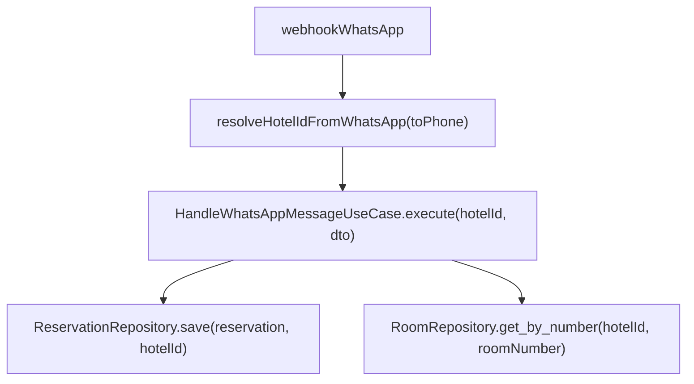

# Multi-tenant no Backend (hotel_id)

Este documento descreve como o backend do Hotel Automation implementa e deve evoluir o modelo multi-tenant por `hotel_id`, alinhado à Clean Architecture e às regras de domínio já existentes.

## 1. Modelo de tenant

- **Tenant**: cada registro em `hotels` representa um tenant (hotel).
- **Usuário SaaS**: a entidade `User` referencia um hotel via `user.hotel_id`.
- **Entidades multi-tenant**: `Reservation`, `Payment`, `Customer`, `Room`, `Lead`, `ConversationCache` e outras possuem campo `hotel_id` na camada de domínio e na tabela SQL correspondente.
- **Isolamento**: toda leitura/escrita de dados de negócio deve ser filtrada por `hotel_id`.

## 2. Onde o hotel_id é decidido

### 2.1 Rotas SaaS autenticadas

- O `hotel_id` vem do usuário autenticado (`User.hotel_id`) e/ou do parâmetro de rota (`/hotels/{hotel_id}/...`).
- A camada `interfaces` (routers FastAPI) é responsável por:
  - Extrair o usuário autenticado.
  - Validar acesso (ex.: `user.hotel_id == hotel_id` ou `role == admin`).
  - Passar `hotel_id` explicitamente para os use cases.

### 2.2 Webhooks de WhatsApp

- Cada hotel pode configurar um número de WhatsApp próprio para atendimento por IA.
- A resolução de tenant segue o padrão:
  1. O provedor (Meta/Twilio) envia o webhook com `to`/`phone_number_id` (número do bot).
  2. O router HTTP normaliza esse número.
  3. Um serviço `TenantResolver` consulta a configuração do hotel para encontrar `hotel_id` a partir do número WhatsApp cadastrado.
  4. O `hotel_id` resolvido é passado para `HandleWhatsAppMessageUseCase.execute(hotel_id, dto)`.

### 2.3 Webhooks de pagamento

- Ao criar um `Payment`, o fluxo de WhatsApp já conhece o `hotel_id` e o persiste em `Payment.hotel_id`.
- No webhook do provedor de pagamento:
  1. O evento traz `payment_id` ou `transaction_id`.
  2. Um repositório específico de webhook (infra) busca o `Payment` correspondente.
  3. O `hotel_id` é obtido de `payment.hotel_id`.
  4. A partir daí, todos os repositórios multi-tenant são chamados com esse `hotel_id`.

## 3. Padrão de use cases multi-tenant

### 3.1 Assinaturas

Para qualquer caso de uso que opera em dados de um hotel específico, a assinatura deve receber `hotel_id` explicitamente:

```python
class SomeUseCase:
    def __init__(self, repository: SomeRepository):
        self.repository = repository

    def execute(self, hotel_id: str, dto: SomeRequestDTO) -> SomeResponseDTO:
        ...
```

Exemplos do projeto:

- `CreateReservationUseCase.create(hotel_id: str, request_dto: CreateReservationRequestDTO)`
- `ListReservationsUseCase.execute(hotel_id: str, ...)`
- `ListPaymentsUseCase.execute(hotel_id: str, ...)`
- `MarkNoShowReservationUseCase.execute(reservation_id: str, hotel_id: str)`

### 3.2 Uso de repositórios

Repositórios de domínio para entidades multi-tenant devem sempre receber `hotel_id`:

- `ReservationRepository.save(reservation, hotel_id)`
- `ReservationRepository.find_by_id(reservation_id, hotel_id)`
- `ReservationRepository.find_by_phone_number(phone, hotel_id)`
- `PaymentRepository.save(hotel_id, payment)`
- `PaymentRepository.find_by_id(hotel_id, payment_id)`
- `RoomRepository.get_by_number(hotel_id, room_number)`
- `RoomRepository.is_available(hotel_id, room_number, check_in, check_out, ...)`

**Regra:** o `hotel_id` nunca deve ser inferido implicitamente dentro do repositório (ex.: variável global). Ele vem da orquestração na camada de aplicação.

## 4. WhatsApp e conversas

### 4.1 Fluxo de resolução de tenant



- O estado de fluxo em Redis deve ser chaveado por `hotel_id` e telefone do hóspede:
  - `flow:{hotel_id}:{phone}`
  - `conversation:{hotel_id}:{phone}`

### 4.2 Use cases específicos de WhatsApp

Use cases como `CheckInViaWhatsAppUseCase`, `CheckoutViaWhatsAppUseCase`, `CancelReservationUseCase`, `ExtendReservationUseCase` e `PreCheckInUseCase` devem seguir o padrão:

- Receber `hotel_id` na assinatura pública.
- Buscar reservas com `find_by_phone_number(phone, hotel_id)`.
- Persistir mudanças com `save(reservation, hotel_id)`.

## 5. Relação com Clean Architecture

- **Domain (`app/domain`)**: define entidades com campo `hotel_id`, value objects, exceções e interfaces de repositório. Não faz descoberta de tenant.
- **Application (`app/application`)**: orquestra casos de uso, recebendo `hotel_id` das camadas de interface e repassando para repositórios.
- **Infrastructure (`app/infrastructure`)**: implementa repositórios SQL/Redis e serviços externos, respeitando o contrato multi-tenant.
- **Interfaces (`app/interfaces`)**: routers FastAPI, webhooks, autenticação e resolução de `hotel_id` a partir de requisições externas.

A decisão de "qual hotel" pertence às bordas (interfaces/application). O domínio permanece focado nas regras de negócio.

## 6. TDD para multi-tenant no backend

Ao criar ou alterar casos de uso multi-tenant, escreva testes que validem:

- Que o `hotel_id` recebido na chamada é repassado corretamente para todas as chamadas de repositório.
- Que um `TenantResolver` (ex.: de WhatsApp) retorna o `hotel_id` correto dado um número de WhatsApp configurado.
- Que dados de hotéis diferentes não se misturam em consultas (ex.: `find_by_phone_number` retorna apenas reservas do hotel correto).

Sugestão de abordagem:

- Usar mocks/doubles de repositório nos testes de use case.
- Usar bancos de teste separados ou fixtures que criam dados com `hotel_id` distintos.

