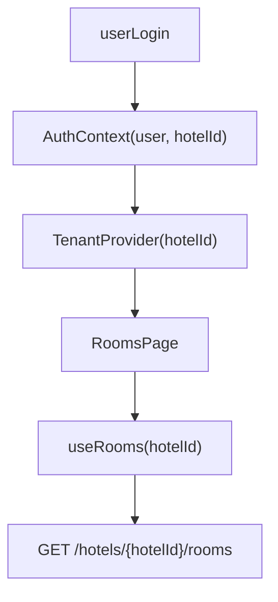

# Multi-tenant no Frontend (hotelId)

Este documento descreve como o frontend do Hotel Automation deve lidar com multi-tenant por `hotelId`, consumindo as APIs SaaS do backend de forma segura e alinhada à arquitetura.

## 1. Conceito de tenant no frontend

- Cada sessão de usuário está associada a **um hotel ativo** (tenant) por vez.
- O `hotelId` pode ser determinado de duas formas principais:
  - Via **token de autenticação** (payload do usuário contém `hotel_id`).
  - Via **rota** com parâmetro explícito, por exemplo `/:hotelId/...`.
- O frontend nunca acessa dados de múltiplos hotéis ao mesmo tempo na mesma sessão.

## 2. Fonte única de verdade: TenantContext

Recomendação:

- Criar um contexto React `TenantContext` (ou hook `useTenant()`) que exponha:
  - `hotelId: string`
  - Metadados opcionais do hotel atual (nome, tema, etc.).
- Esse contexto deve ser inicializado a partir de:
  - Informações retornadas no login (ex.: `/auth/login` devolve `user` com `hotel_id`).
  - Ou do parâmetro de rota principal.

Todos os componentes de página e hooks devem obter `hotelId` a partir de `useTenant()` quando possível.

## 3. Consumo de APIs SaaS com hotelId

As chamadas em `frontend/src/api/client.ts` devem seguir alguns princípios:

- Endpoints que dependem de um hotel específico devem incluir `hotelId` na URL ou nos parâmetros.
- Exemplo de convenção de URL:
  - `/hotels/{hotelId}/rooms`
  - `/hotels/{hotelId}/reservations`
  - `/hotels/{hotelId}/payments`
- Alternativamente, se o backend definir rota única, o `hotelId` pode ser enviado em header específico (`X-Hotel-Id`), mas a abordagem preferencial é via path.

Diagrama simplificado do fluxo:

## 4. Hooks e páginas multi-tenant

### 4.1 Hooks de dados

Hooks como `useRooms`, `useReservations`, `useHotelConfig` e similares devem:

- Receber `hotelId` como parâmetro **ou**
- Chamar internamente `useTenant()` para obter o `hotelId` corrente.

Em ambos os casos, o hook deve sempre incluir o `hotelId` na chamada de API.

### 4.2 Páginas de configuração e dashboard

Páginas como `HotelConfig`, dashboards SaaS e relatórios devem ser ancoradas em um tenant único:

- A rota deve ser protegida por autenticação.
- O `hotelId` deve ser definido via contexto e/ou parâmetro de rota.
- Nenhuma página deve renderizar dados de mais de um hotel simultaneamente.

## 5. Regras de segurança e isolamento no frontend

- O frontend **não deve** permitir que o usuário mude manualmente o `hotelId` para acessar dados de outro hotel sem passar pelo fluxo de autorização do backend.
- Quando o backend expõe endpoints com `hotel_id` no path, o frontend deve utilizar apenas valores de `hotelId` provenientes do contexto autenticado.
- Qualquer mudança de `hotelId` (ex.: em ambientes multi-filial) deve passar por um fluxo de troca de tenant explícito (selector controlado e validado pelo backend).

## 6. Testes (TDD) para multi-tenant no frontend

Ao criar ou alterar hooks/páginas multi-tenant:

- Escrever testes que verifiquem que o `hotelId` enviado para a API é o esperado (mockando `fetch` ou o client HTTP).
- Garantir que, quando `useTenant()` retornar um `hotelId` diferente, as URLs chamadas pelo hook também mudam.
- Testar que componentes de alto nível não quebram quando o `hotelId` ainda não está carregado (ex.: estado de loading inicial).

Sugestão de cenários de teste:

1. `useRooms(hotelId)` monta a URL correta (`/hotels/{hotelId}/rooms`).
2. `useReservations` inclui `hotelId` em todas as variações de filtros.
3. Páginas protegidas renderizam mensagem de erro ou redirecionam se não houver `hotelId` disponível.

