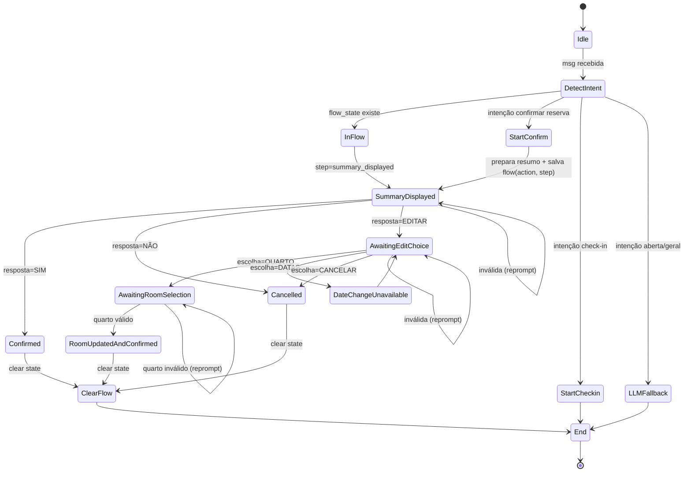

# Guia de Orquestração de Conversas WhatsApp

Este guia explica como o projeto orquestra conversas no WhatsApp usando fluxo determinístico + fallback para IA, com foco na classe `HandleWhatsAppMessageUseCase`.

## Visão geral

No projeto, `HandleWhatsAppMessageUseCase` funciona como o maestro da conversa:

- recebe a mensagem de entrada;
- identifica se existe um fluxo em andamento;
- decide se a mensagem vai para um fluxo transacional (check-in, confirmação de reserva) ou para conversa assistida por IA;
- devolve uma resposta padronizada (`WhatsAppMessageResponseDTO`).

Arquivo principal:

- `app/application/use_cases/handle_whatsapp_message.py`

## Conceitos implementados

### 1) Orquestração central (roteador)

O método `execute` é o ponto único de decisão da mensagem:

1. Normaliza entrada (`text`, `content_lower`, `phone`).
2. Busca estado atual no cache (`flow:<phone>`).
3. Se houver fluxo ativo, continua esse fluxo.
4. Se não houver fluxo ativo, detecta intenção de iniciar novo fluxo.
5. Trata intents determinísticas (ex.: check-in).
6. Faz fallback para IA em mensagens abertas.

### 2) Máquina de estados simples (FSM)

O fluxo de confirmação de reserva usa estados explícitos:

- `summary_displayed`
- `awaiting_edit_choice`
- `awaiting_room_selection`

Cada estado tem um handler específico e transições claras com base na resposta do usuário.

### 3) Memória de conversa por telefone (cache + TTL)

O estado de fluxo é salvo com chave por telefone:

- prefixo: `flow:`
- TTL padrão: 900s

Isso permite manter contexto entre mensagens sem acoplar a camada de interface à lógica de negócio.

### 4) Separação de responsabilidades

- `HandleWhatsAppMessageUseCase`: orquestra e decide caminhos.
- `ConfirmReservationUseCase`: regra de negócio de confirmação/estado da reserva.
- `CheckInViaWhatsAppUseCase`: regra de check-in.
- `ConversationUseCase`: histórico + contexto + chamada à IA.

### 5) Guardrails transacionais

Ações críticas (confirmar/cancelar/editar reserva) são tratadas por regras determinísticas, não delegadas ao LLM.

### 6) Resiliência e fallback

Em exceções, o fluxo retorna mensagens amigáveis ao usuário e mantém a API resiliente.

## Intenção x Etapa de fluxo

Nem toda função interna representa intenção.

- **Intenção/classificação**: métodos `_is_*`.
- **Início de fluxo**: métodos `_start_*`.
- **Etapas/transições**: métodos `_handle_*`.
- **Infra de estado**: `_get_flow_state`, `_set_flow_state`, `_clear_flow_state`.

Regra prática:

- `is_*` = classificar entrada
- `start_*` = iniciar fluxo
- `handle_*` = processar passo da conversa
- `get/set/clear_*` = persistir contexto

## Blueprint: intenção -> handler -> próximo estado

- `confirm + reserva` -> `_start_confirm_reservation_flow` -> `summary_displayed`
- `SIM` em `summary_displayed` -> `_handle_summary_response` -> confirma e encerra
- `NÃO` em `summary_displayed` -> `_handle_summary_response` -> cancela e encerra
- `EDITAR` em `summary_displayed` -> `_handle_summary_response` -> `awaiting_edit_choice`
- `QUARTO` em `awaiting_edit_choice` -> `_handle_edit_choice` -> `awaiting_room_selection`
- quarto válido em `awaiting_room_selection` -> `_handle_room_selection` -> salva e encerra
- entrada inválida -> reprompt curto + mantém estado

## Diagrama de fluxo (Mermaid)

## Checklist para criar novos fluxos

1. Definir `ACTION_*` e `STEP_*`.
2. Detectar intenção no `execute`.
3. Criar `_start_novo_fluxo` para inicializar estado.
4. Criar `_handle_novo_fluxo` com transições por `step`.
5. Persistir apenas contexto mínimo no cache.
6. Sempre limpar estado em saídas terminais.
7. Criar reprompts curtos para entradas inválidas.
8. Cobrir transições principais com testes unitários.

## Boas práticas

- Priorizar continuidade de fluxo ativo antes de abrir novos fluxos.
- Evitar colocar regra de negócio pesada no `execute`.
- Usar LLM para linguagem natural e suporte, não para decisões críticas de transação.
- Manter respostas de erro claras e orientadas à próxima ação do usuário.
